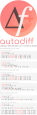
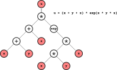

---


# {{autodiff}}

{{autodiff}} is a C++17 library that uses modern and advanced programming
techniques to enable automatic computation of derivatives in an efficient, easy,
and intuitive way.

## Demonstration

Consider the following function *f(x, y, z)*:

```c++
double f(double x, double y, double z)
{
    return (x + y + z) * exp(x * y * z);
}
```

which we use use to evaluate the variable *u = f(x, y, z)*:

```c++
double x = 1.0;
double y = 2.0;
double z = 3.0;
double u = f(x, y, z);
```

How can we minimally transform this code so that not only *u*, but also its
derivatives *∂u/∂x*, *∂u/∂y*, and *∂u/∂z*, can be computed?

The next two sections present how this can be achieved using two automatic
differentiation algorithms implemented in {{autodiff}}: **forward mode** and
**reverse mode**.

### Forward mode

In a *forward mode automatic differentiation* algorithm, both output variables
and one or more of their derivatives are computed together. For example, the
function evaluation *f(x, y, z)* can be transformed in a way that it will not
only produce the value of *u*, *the output variable*, but also one or more of
its derivatives *(∂u/∂x,  ∂u/∂y, ∂u/∂z)* with respect to the *input
variables* *(x, y, z)*.

Enabling forward automatic differentiation for the calculation of derivatives
using {{autodiff}} is relatively simple. For our previous function *f*, we only
need to replace the floating-point type `double` with `autodiff::dual` for both
input and output variables:

```c++
dual f(const dual& x, const dual& y, const dual& z)
{
    return (x + y + z) * exp(x * y * z);
}
```

We can now compute the derivatives *∂u/∂x*,  *∂u/∂y*, and *∂u/∂z* as follows:

```c++
dual x = 1.0;
dual y = 2.0;
dual z = 3.0;
dual u = f(x, y, z);

double ux = derivative(f, wrt(x), at(x, y, z));
double uy = derivative(f, wrt(y), at(x, y, z));
double uz = derivative(f, wrt(z), at(x, y, z));
```

The auxiliary function `autodiff::wrt`, an acronym for **with respect to**,
is used to indicate which input variable *(x, y, z)* is the selected one to
compute the partial derivative of *f*. The auxiliary function `autodiff::at`
is used to indicate where (at which values of its parameters) the derivative
of *f* is evaluated.

### Reverse mode

In a *reverse mode automatic differentiation* algorithm, the output variable of
a function is evaluated first. During this function evaluation, all
mathematical operations between the input variables are *"recorded"* in an
*expression tree*. By traversing this tree from top-level (output variable as
the root node) to bottom-level (input variables as the leaf nodes), it is
possible to compute the contribution of each branch on the derivatives of the
output variable with respect to input variables.



Thus, a single pass in a reverse mode calculation **computes all derivatives**,
in contrast with forward mode, which requires one pass for each input variable.
Note, however, that it is possible to change the behavior of a forward pass so
that many (perhaps even all) derivatives of an output variable are computed
simultaneously (e.g., in a single forward pass, *∂u/∂x*,  *∂u/∂y*, and *∂u/∂z*
are evaluated together with *u*, in contrast with three forward passes, each
one computing the individual derivatives).

Similar as before, we can use {{autodiff}} to enable reverse automatic
differentiation for our function *f* by simply replacing type `double` with
`autodiff::var` as follows:

```c++
var f(var x, var y, var z)
{
    return (x + y + z) * exp(x * y * z);
}
```

The code below demonstrates how the derivatives *∂u/∂x*,  *∂u/∂y*, and *∂u/∂z*
can be calculated:

```c++
var x = 1.0;
var y = 2.0;
var z = 3.0;
var u = f(x, y, z);

auto [ux, uy, uz] = derivatives(u, wrt(x, y, z));
```

The function `autodiff::derivatives` will traverse the expression tree stored
in variable `u` and compute all its derivatives with respect to the input
variables *(x, y, z)*.

## Questions?

Contact us on our [GitHub Discussion Channel][discussion] if you need support
and assistance when using {{autodiff}}. If you would like to report a bug, then
please create a new [GitHub Issue][issues].

[discussion]: https://github.com/autodiff/autodiff/discussions/new?category=q-a
[issues]: https://github.com/autodiff/autodiff/issues/new
